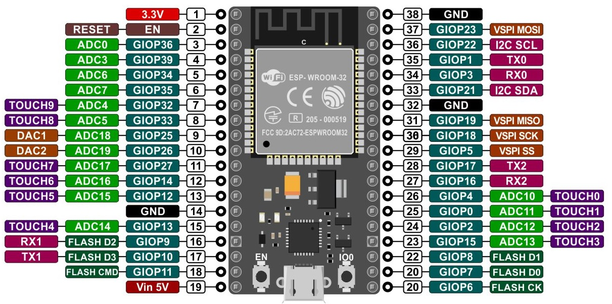

# PocketCube
Proyecto satelital del grupo de investigación SyCE (Simulación y calculo de campos electrómagneticos)

# Pinout de I2C para ESP32 y Arduino Uno

Este documento proporciona una descripción concisa del pinout de los pines I2C en el ESP32 y el Arduino Uno.

## ESP32

El ESP32 utiliza los siguientes pines para la comunicación I2C por defecto:

- **SDA (Data):** GPIO 21
- **SCL (Clock):** GPIO 22

Es posible cambiar estos pines en el código, pero estos son los pines predeterminados para la mayoría de las placas ESP32.

## Arduino Uno

El Arduino Uno utiliza los siguientes pines para la comunicación I2C:

- **SDA (Data):** Pin A4
- **SCL (Clock):** Pin A5

Estos pines están conectados internamente al módulo TWI (Two Wire Interface) del microcontrolador.

## Referencias

Para más información, consulta la documentación oficial de [ESP32](https://www.espressif.com/en/products/socs/esp32/resources) y [Arduino Uno](https://www.arduino.cc/en/Main/ArduinoBoardUno).