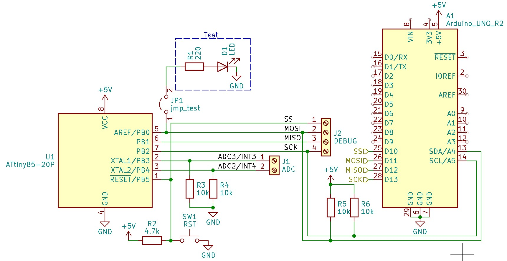

# PocketCube
Proyecto satelital desarrollado por el grupo de investigación **SyCE** (Simulación y Cálculo de Campos Electromagnéticos).

## Funcionamiento de la Aplicación
La aplicación se encarga de monitorear las lecturas provenientes de un **1 pin de entrada** habilitados en la *Carga Útil*.

### Características de la Aplicación

- **Selección de puerto**: Se identifican los dispositivos conectados al ordenador, el usuario debe seleccionar el correspondiente al Arduino UNO (Pocket Main).
  *ACLARACIÓN:* Seleccionar CH014 , arduino chino conectado actualmente en el poncho.

- **Recepción de datos**: Solo se presentan los datos procesados y enviados por el **Arduino UNO** (Pocket Main) a través del puerto serial. 
- **Ventanas de monitoreo**: Se cuenta con dos ventanas, para visualizar datos clasficados y ordenados desde la *Carga Útil*:
- **Indicación de estado**: en forma simple el Arduino puede indicar algun estado en particular
  - **Read EEPROM**: Lectura de memoria EEPROM
  - **Clear EEPROM**: Vacio de memoria EEPROM
  - **Read MEAS**: Lectura de datos matcheados con RTC
  - **Error**: Estado particular cuando no se reonoce ID

- **Tablas de registro de datos**: Pariticularmente sólo presenta los datos recibidos en un formato extendido (ver sección [Procesamiento de datos](#procesamiento-de-datos)) 

- **Barra de progreso**: Indica el espacio de la memoria EEPROM
- **Displays LCD**: Se cuenta con 2 display para mostrar tiempos
  - **Display 1**: Muestra el horario actual registrada por PocketMain.
  - **Display 2**: Muestra la fecha actual registrada por PocketMain.

## Pocket Main
Es el Arduino chino conectado con el poncho, con los modulos que se estara trabajando. Actualmente tiene cargado el programa para funcionar con la otro Arduino UNO como *Carga Útil*.

### Comunicación I2C con la Carga Útil
Se utiliza el protocolo **I2C** para la comunicación entre el **Arduino UNO** (Pocket Main) y la **Carga Útil** (Arduino UNO o ATtiny85).

| Pin ATtiny85 | Pin Arduino UNO   | Pin PocketMain | Función  |
|--------------|-------------------|----------------|----------|
| PB0          | A4                | A4             | SDA      |
| PB2          | A5                | A5             | SCL/SCK  |
| GND          | GND               | GND            | GND      |

### Procesamiento de datos
El **Arduino UNO** es responsable de recibir, procesar y enviar los datos provenientes de la Carga Útil a la aplicación.
Los datos se muestran en uno de los siguientes formatos para optimizar tramas de datos:
  - **Formato simple**: `{ID},{value}`
  - **Formato extendido**: `{ID},{datetime} {value}`

  ### Asignación de IDs
  Para simplificar la identificación de los diferentes datos, se han asignado los siguientes **ID**:

  | ID    | Descripción     |
  |-------|-----------------|
  | 1     | MEAS1           |
  | 2     | MEAS2           |
  | 3     | RTC             |
  | 4     | EEPROM_USED     |
  | 5     | EEPROM_DATA     |
  | 6     | STATE           |

  Estos formatos permiten identificar fácilmente el origen de los datos (`ID`) y el valor asociado (`value`). En el formato extendido, se incluye además información adicional como la marca de tiempo (`datetime`) y un valor (`value`).
  
## Carga Útil
### Con Attiny85
La Carga Útil opera en modo de conteo de pulso por PCINT: **Modo ISR** (PB3).

- **Aclaración**: El Attiny por su limitaciones de pines, no se puede usar en simultaneo el uso de Interrupciones y el I2C, debido a que utilizan el mismo pin para los pulsos de clock (SCL), como alternativa cuenta con pines PCINT que son similares a las interrupciones pero no son configurables el metodo de detección de pulsos, solo admite por CHANGE. Tambien tener en cuenta que al no ser con las ISR no son precisos y presentan otra complicaciones.

Para cargar programas (Debuggear) al ATtiny85 con el Arduino UNO, ver sección [Depuración y Carga de Programas en el ATtiny85](#Depuración-y-Carga-de-Programas-en-el-ATtiny85)

#### Esquemáticos de Conexión

#### Montaje de Ponchos
Esta sección describe el montaje de los ponchos para conectar los componentes del PocketCube.

### Con Arduino UNO

---

## Pinouts de microcontroladores
### Arduino Uno

El **Arduino Uno** utiliza los siguientes pines para la comunicación I2C:

- **SDA (Data):** Pin A4
- **SCL (Clock):** Pin A5

Estos pines están conectados internamente al módulo TWI (Two Wire Interface) del microcontrolador.

### ATtiny85

El **ATtiny85** utiliza los siguientes pines:

## Depuración y Carga de Programas en el ATtiny85

Para cargar un programa en el **ATtiny85** utilizando un **Arduino UNO** como programador, sigue estos pasos. Es necesario conectar los pines de depuración (Debugger) de acuerdo a la interfaz SPI.

### Conexión de Pines SPI (Debugger)

Conecta los pines del **Arduino UNO** a los del **ATtiny85** de la siguiente manera:

- **SS (Slave Select):** Pin 1 (Móodulo ATtiny85)
- **MOSI (Master Out Slave In):** Pin 2 (Módulo ATtiny85)
- **MISO (Master In Slave Out):** Pin 3 (Módulo ATtiny85)
- **SCK (Serial Clock):** Pin 4 (Módulo ATtiny85)

### Carga del Programa "ArduinoISP"

Una vez realizada la conexión de los pines, sigue estos pasos:

1. En el IDE de Arduino, ve a **Ejemplos -> ArduinoISP -> ArduinoISP.ino**.
2. Carga este programa en tu **Arduino UNO**.

### Instalación de la Librería para el ATtiny85

Antes de cargar cualquier programa en el **ATtiny85**, asegúrate de que el IDE de Arduino tenga instalada la librería necesaria para reconocer el microcontrolador.

1. Ve a **Preferencias** en el IDE de Arduino.
2. En el campo **Gestor de URLs Adicionales de Tarjetas**, añade la siguiente URL:
https://mcudude.github.io/MiniCore/package_MCUdude_MiniCore_index.json
3. Descargar libreria TinyWireS: 
https://playground.arduino.cc/uploads/Code/TinyWireS/index.zip
4. Descomprimir el .zip y agregar a la carpeta ***libraries*** de Arduino
5. Finalmente resetear IDE Arduino para guardar configuraciones

### Configuración en el IDE de Arduino

Una vez que la librería esté instalada, configura el IDE de Arduino de la siguiente manera:

- **Placa:** ATtiny25/45/85
- **Clock:** Internal 1MHz
- **Proccessor:** ATtiny85
- **Port:** [Selecciona el puerto correspondiente al Arduino UNO]
- **Programador:** Arduino as ISP

### Carga de programas en el ATtiny85

Con la configuración correcta y el **Arduino UNO** programado como ISP, ya puedes cargar un programa en el **ATtiny85** de la misma manera que lo harías en un Arduino UNO. Solo asegúrate de seleccionar el **programador** correcto antes de realizar la carga.

## Referencias

Para más información, consulta la documentación oficial de [attitny85](https://www.microchip.com/en-us/product/attiny85) y [Arduino Uno](https://www.arduino.cc/en/Main/ArduinoBoardUno).
