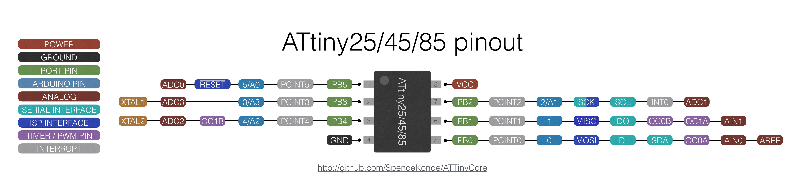

# PocketCube
Proyecto satelital del grupo de investigación SyCE (Simulación y calculo de campos electrómagneticos)

# Pinout de I2C para Arduino Uno y ATtiny85

Este documento proporciona una descripción concisa del pinout de los pines I2C en el Arduino Uno y ATtiny85.

## Arduino Uno

El Arduino Uno utiliza los siguientes pines para la comunicación I2C:

- **SDA (Data):** Pin A4
- **SCL (Clock):** Pin A5

Estos pines están conectados internamente al módulo TWI (Two Wire Interface) del microcontrolador.

## ATtiny85

## Referencias

Para más información, consulta la documentación oficial de [attitny85](https://www.microchip.com/en-us/product/attiny85) y [Arduino Uno](https://www.arduino.cc/en/Main/ArduinoBoardUno).
