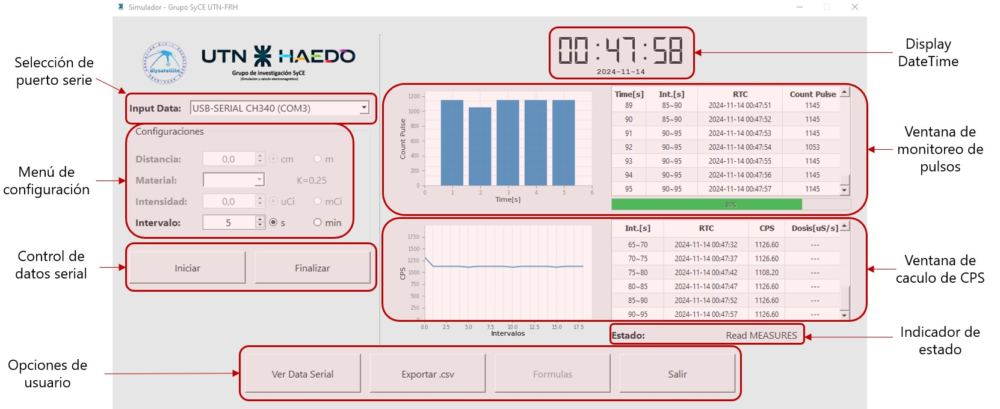
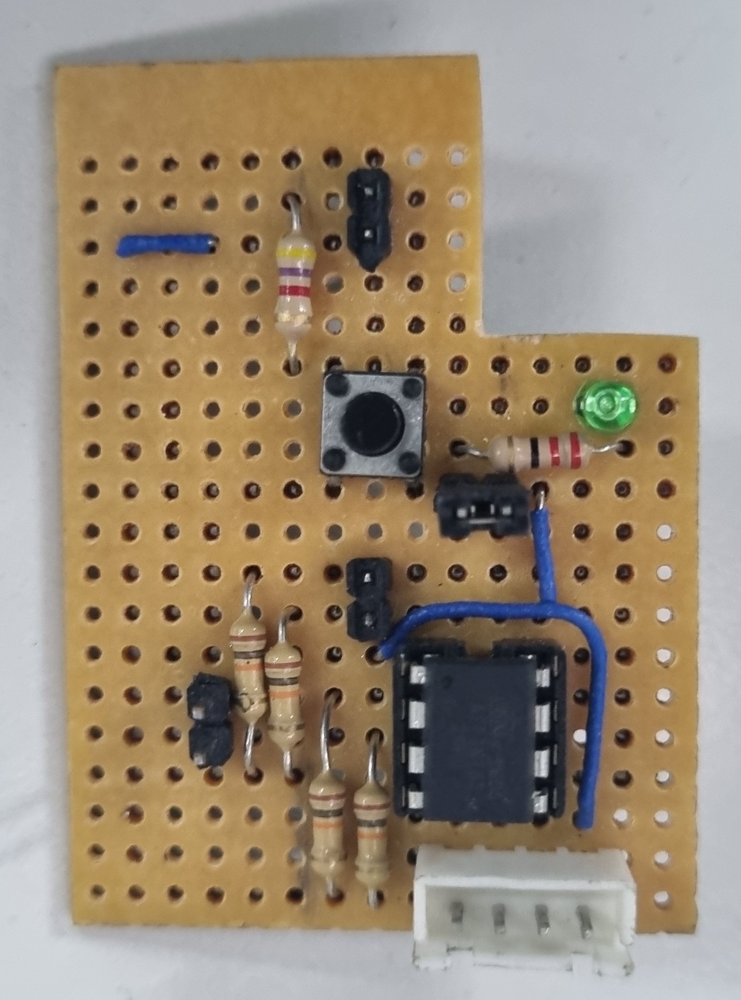
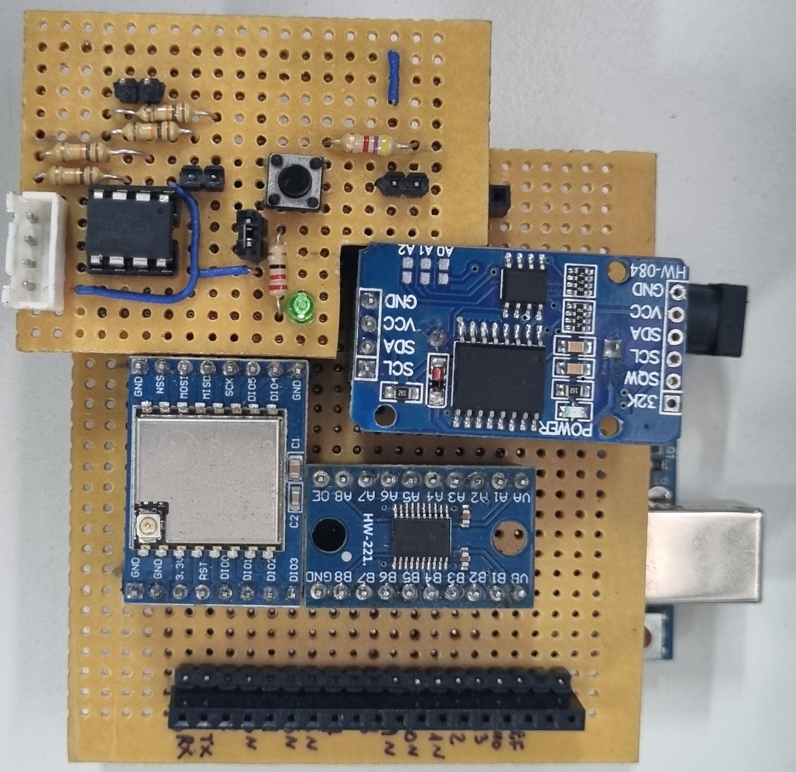
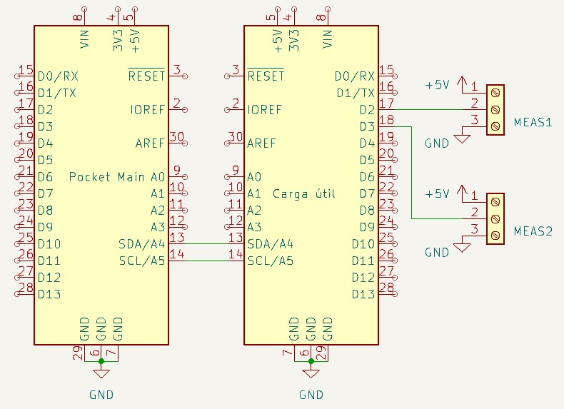
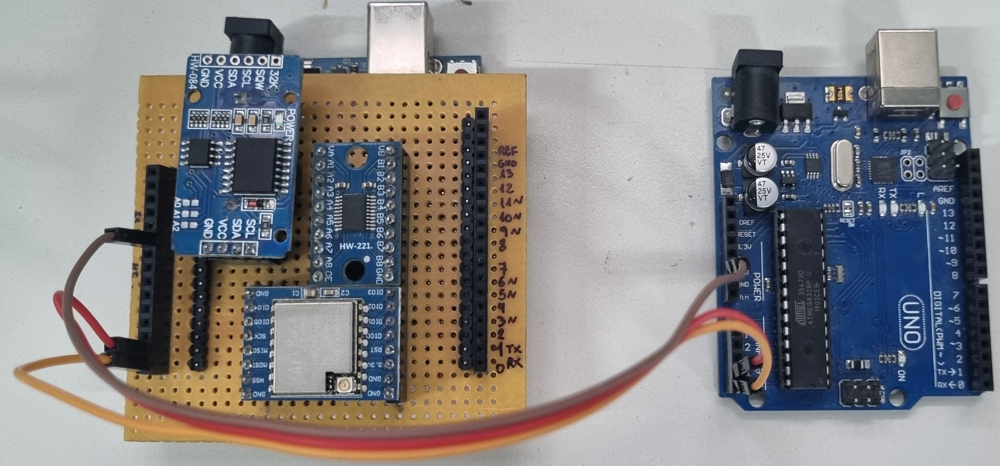
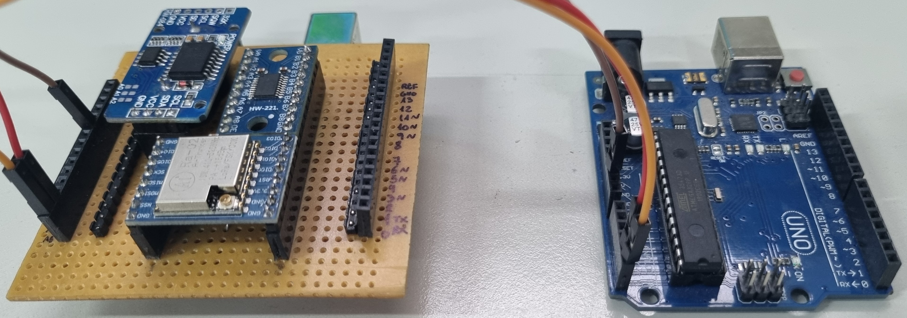
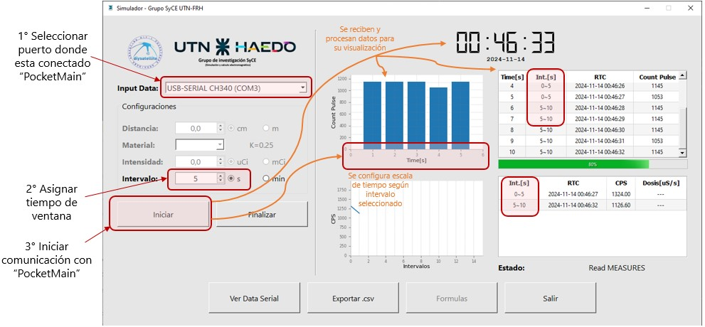
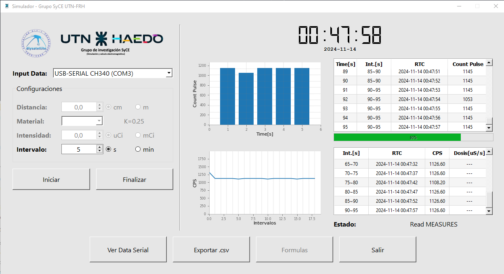
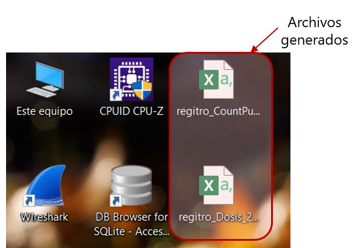
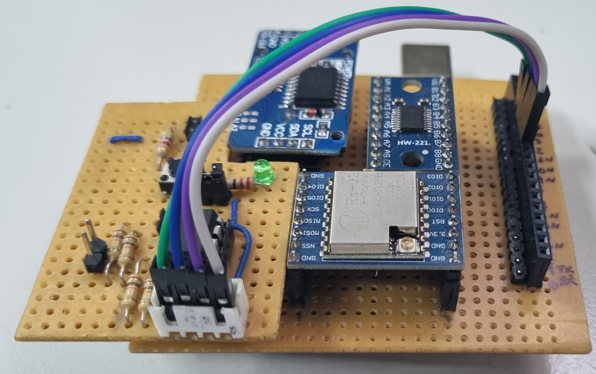

# PocketCube
Proyecto satelital desarrollado por el grupo de investigación **SyCE** (Simulación y Cálculo de Campos Electromagnéticos).

## Funcionamiento de la Aplicación
La aplicación se encarga de monitorear las lecturas provenientes de un **1 pin de entrada** habilitados en la *Carga Útil*.

### Características de la Aplicación

- **Selección de puerto serie**: Se identifican los dispositivos conectados al ordenador, el usuario debe seleccionar el correspondiente al Arduino UNO (Pocket Main).
  *ACLARACIÓN:* Seleccionar CH340 , arduino chino conectado actualmente en el poncho.

- **Menu de configuración**: Menu interactivo para usuario realizar la configuraciones necesarias para determinar el procesaimentos de lo datos a visualizar.
- **Display DateTime**: Se cuenta con 2 display para mostrar tiempos
  - **Display 1**: Muestra el horario actual registrada por PocketMain.
  - **Display 2**: Muestra la fecha actual registrada por PocketMain.
- **Ventana de monitoreo de pulsos**: Permite visualizar las mediciones solicitadas y realizadas por la *Carga Útil*. En esta ventana se cuentan con:
  - **Grafico de barras**: Muestra los pulsos detectados por la *Carga Útil*, limitado por el intervalo de tiempo asignado por el usuario.
  - **Tabla contador de pulsos**: Muestra el registro de datos ordenados a medida que el *Pocket Main* reciba datos (ver sección [Procesamiento de datos](#procesamiento-de-datos))
  - **Barra de progreso**: Barra de carga que indica cuando se cumple el intervalo de tiempo asignado.
- **Ventana de calculo de CPS**: Permite visualizar el promedio obtenido en cada intervalo de tiempo (CPS).
  - **Grafico de lineas**: Muestra el avance de los CPS obtenidos en cada intervalo.
  - **Tabla contador de pulsos**: Muestra el registro de los calculos obtenidos para cada intervalo.
- **Indicador de estado**: en forma simple el Arduino puede indicar algun estado en particular
  - **Read EEPROM**: Lectura de memoria EEPROM
  - **Clear EEPROM**: Vacio de memoria EEPROM
  - **Read MEAS**: Lectura de datos matcheados con RTC
  - **Error**: Estado particular cuando no se reonoce ID
- **Opciones de usuario**: Botones para interactuar con la aplicación.
  - **Ver Data Serial**: Visualiza en un tabal todos los datos recibidos, no procesados, por la aplicación.**[No disponible]**
  - **Exportar CSV**: Crea 2 archivos .csv , cada uno todos los datos registrados en la tablas de ambas ventanas de datos.
  - **Formulas**: **[No disponible]**
  - **Salir**: Cierra la aplicación y todos los procesos relacionados.

## Pocket Main
El Arduino conectado con el poncho de módulos se lo considera el *Pocket Main*. 

**ACLARACIÓN:**: Actualmente tiene cargado el programa para funcionar con la otro Arduino UNO como *Carga Útil*.

### Comunicación I2C con la Carga Útil
Se utiliza el protocolo **I2C** para la comunicación entre el **Arduino UNO** (Pocket Main) y la **Carga Útil** (Arduino UNO o ATtiny85).

| Pin ATtiny85 | Pin Arduino UNO   | Pin PocketMain | Función  |
|--------------|-------------------|----------------|----------|
| PB0          | A4                | A4             | SDA      |
| PB2          | A5                | A5             | SCL/SCK  |
| GND          | GND               | GND            | GND      |

### Procesamiento de datos
El **Arduino UNO** es responsable de recibir, procesar y enviar los datos provenientes de la Carga Útil a la aplicación.
Los datos se muestran en uno de los siguientes formatos para optimizar tramas de datos:
  - **Formato simple**: `{ID},{value}`
  - **Formato extendido**: `{ID},{datetime} {value}`

  ### Asignación de IDs
  Para simplificar la identificación de los diferentes datos, se han asignado los siguientes **ID**:

  | ID    | Descripción     |
  |-------|-----------------|
  | 1     | MEAS1           |
  | 2     | MEAS2           |
  | 3     | RTC             |
  | 4     | EEPROM_USED     |
  | 5     | EEPROM_DATA     |
  | 6     | STATE           |

  Estos formatos permiten identificar fácilmente el origen de los datos (`ID`) y el valor asociado (`value`). En el formato extendido, se incluye además información adicional como la marca de tiempo (`datetime`) y un valor (`value`).
  
## Carga Útil
### Con Attiny85
La Carga Útil opera en modo de conteo de pulso por PCINT: **Modo ISR** (PB3 Habilitado).

| Pin ATtiny85 | Tipo de pin   | Modo de operación | Función  |
|--------------|---------------|-------------------|----------|
| PB3          | PCINT3        | CHANGE            | MEAS1    |
| PB4          | PCINT4        | CHANGE            | MEAS2    |

- **Aclaración**: El Attiny por su limitaciones de pines, no se puede usar en simultaneo el uso de Interrupciones y el I2C, debido a que utilizan el mismo pin para los pulsos de clock (SCL), como alternativa cuenta con pines PCINT que son similares a las interrupciones pero no son configurables el metodo de detección de pulsos, solo admite por CHANGE. Tambien tener en cuenta que al no ser con las ISR no son precisos y presentan otra complicaciones.

Para cargar programas (Debuggear) al ATtiny85 con el Arduino UNO, ver sección [Depuración y Carga de Programas en el ATtiny85](#Depuración-y-Carga-de-Programas-en-el-ATtiny85)

#### Esquemáticos de Conexión

#### Montaje de Poncho

### Con Arduino UNO
Opera contando pulsos por ISR, interupciones por Hardware. A diferencia de los PCINT son mas precisos: **Modo ISR** (Pin 2 Habilitado).

| Pin Arduino  | Tipo de pin   | Modo de operación | Función  |
|--------------|---------------|-------------------|----------|
| Pin2         | INT0          | RISING            | MEAS1    |
| Pin3         | INT1          | RISING            | MEAS2    |

#### Esquemáticos de Conexión

#### Montaje de Pocket Main con Carga Útil

## Ejemplos de uso
### Con Arduino UNO
#### Pasos previos
1. Asegurarse de tener conectados todos ambas placas de desarrollo como se indica en el esquematico. En caso de *Pocket Main* la conexión ya esta realiza en el poncho.
2. Cargar programa en Arduino UNO referido como *PocketMain* ( [Programa_PocketMain](Carga_util/pocket_slave/pocket_main.ino) )
3. Cargar programa en Arduino UNO referido como *Carga Útil* ( [Programa_Carga_Útil](Carga_util/pocket_slave/pocket_slave.ino) )
4. Conectar *PocketMain* a PC, y *Carga Útil* a la alimentación del *Pocket Main* o tambien puede ser alimentado por una fuente externa: PC o fuente de 5VDC.
5. Asegurarse que la PC reconce los Arduinos, principalmete si se opera con un Arduino chino. Si alguno de los Arduino es chino instalar: 
[URL_Arduino_chino](https://www.arduined.eu/ch340-windows-10-driver-download/). Verificarlo en *Adminitrador de dispositivos*.

Una vez finalizados los *Pasos previos*, acceder a la aplicación de escritorio.

1. Al iniciar la aplicación detectara loos dispositivos conectados en los puertos. Seleccionar: **USB-SERIAL CH340** (si tiene como *PocketMain* el Arduino chino).

2. Una vez seleccionado el dispositivo, ingresar el intervalo de tiempo para cada ventana de tiempo.

3. Con esto configurado, click en *Iniciar* y empezara a correr el programa.

El *Pocket Main* empezara a solicitar lecturas realizadas a la *Carga Útil* cada **1 segundo** esto controlado por un TIMER interno. Estas lecturas son indentificadas por la aplicación, procesadas y presentadas tanto en el gráfico de barras como en la tabla. La duración de cada proceso dependera del intervalo de tiempo asignado por el usuario, el cual se podrá ver su progreso en una barra de carga.

Al finalizar cada intervalo de tiempo, la aplicación procesa estos datos, obteniendo el promedio de estos (CPS). Estos podrán tambien visualizarse en el gráfico de lineas y en la tabla continua.

Todos estos datos son visualizados en tiempo real, pero tambien registrados en un Dataframe el cual cuando el usuario lo solicite pueden exportarse como archivos CSV. 

## Pinouts de microcontroladores
### Arduino Uno

El **Arduino Uno** utiliza los siguientes pines para la comunicación I2C:

Estos pines están conectados internamente al módulo TWI (Two Wire Interface) del microcontrolador.

### ATtiny85

El **ATtiny85** utiliza los siguientes pines:

## Depuración y Carga de Programas en el ATtiny85

Para cargar un programa en el **ATtiny85** utilizando un **Arduino UNO** como programador, sigue estos pasos. Es necesario conectar los pines de depuración (Debugger) de acuerdo a la interfaz SPI.

### Conexión de Pines SPI (Debugger)

Conecta los pines del **Arduino UNO** a los del **ATtiny85** de la siguiente manera:

| Pin Poncho ATtiny85 | Pin Arduino UNO   | Función  |      Descripción    |
|---------------------|-------------------|----------|---------------------|
| 1                   | 10                | SS       | Slave Select        |
| 2                   | 11                | MOSI     | Master Out Slave In |
| 3                   | 12                | MISO     | Master In Slave Out |
| 4                   | 13                | SCK      | Serial Clock        |

- **SS (Slave Select):** Pin 1 (Móodulo ATtiny85)
- **MOSI (Master Out Slave In):** Pin 2 (Módulo ATtiny85)
- **MISO (Master In Slave Out):** Pin 3 (Módulo ATtiny85)
- **SCK (Serial Clock):** Pin 4 (Módulo ATtiny85)

### Carga del Programa "ArduinoISP"

Una vez realizada la conexión de los pines, sigue estos pasos:

1. En el IDE de Arduino, ve a **Ejemplos -> ArduinoISP -> ArduinoISP.ino**.
2. Carga este programa en tu **Arduino UNO**.

### Instalación de la Librería para el ATtiny85

Antes de cargar cualquier programa en el **ATtiny85**, asegúrate de que el IDE de Arduino tenga instalada la librería necesaria para reconocer el microcontrolador.

1. Ve a **Preferencias** en el IDE de Arduino.
2. En el campo **Gestor de URLs Adicionales de Tarjetas**, añade la siguiente URL:
https://mcudude.github.io/MiniCore/package_MCUdude_MiniCore_index.json
3. Descargar libreria TinyWireS: 
https://playground.arduino.cc/uploads/Code/TinyWireS/index.zip
4. Descomprimir el .zip y agregar a la carpeta ***libraries*** de Arduino
5. Finalmente resetear IDE Arduino para guardar configuraciones

### Configuración en el IDE de Arduino

Una vez que la librería esté instalada, configura el IDE de Arduino de la siguiente manera:

- **Placa:** ATtiny25/45/85
- **Clock:** Internal 1MHz
- **Proccessor:** ATtiny85
- **Port:** [Selecciona el puerto correspondiente al Arduino UNO]
- **Programador:** Arduino as ISP

### Carga de programas en el ATtiny85

Con la configuración correcta y el **Arduino UNO** programado como ISP, ya puedes cargar un programa en el **ATtiny85** de la misma manera que lo harías en un Arduino UNO. Solo asegúrate de seleccionar el **programador** correcto antes de realizar la carga.

## Referencias

Para más información, consulta la documentación oficial de [attitny85](https://www.microchip.com/en-us/product/attiny85) y [Arduino Uno](https://www.arduino.cc/en/Main/ArduinoBoardUno).
