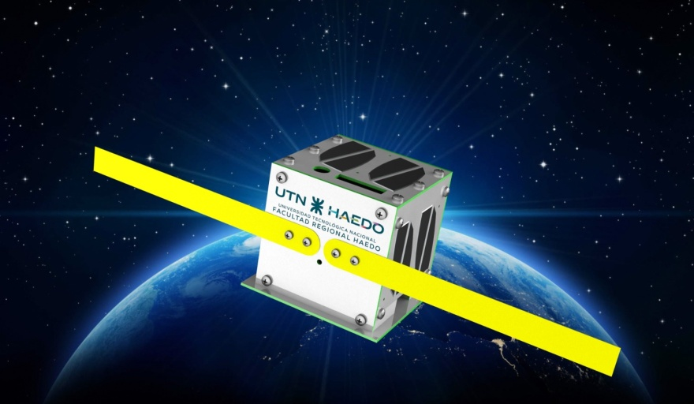
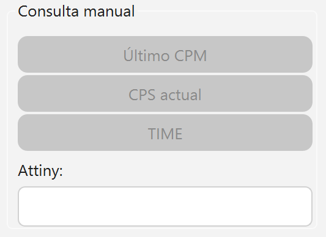
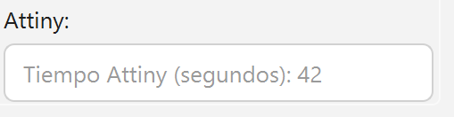
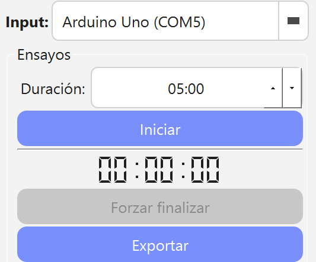
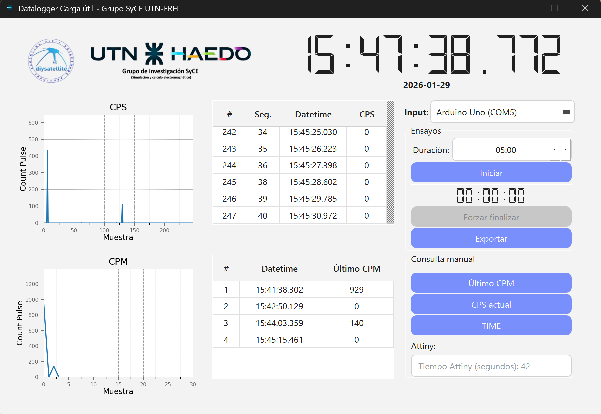
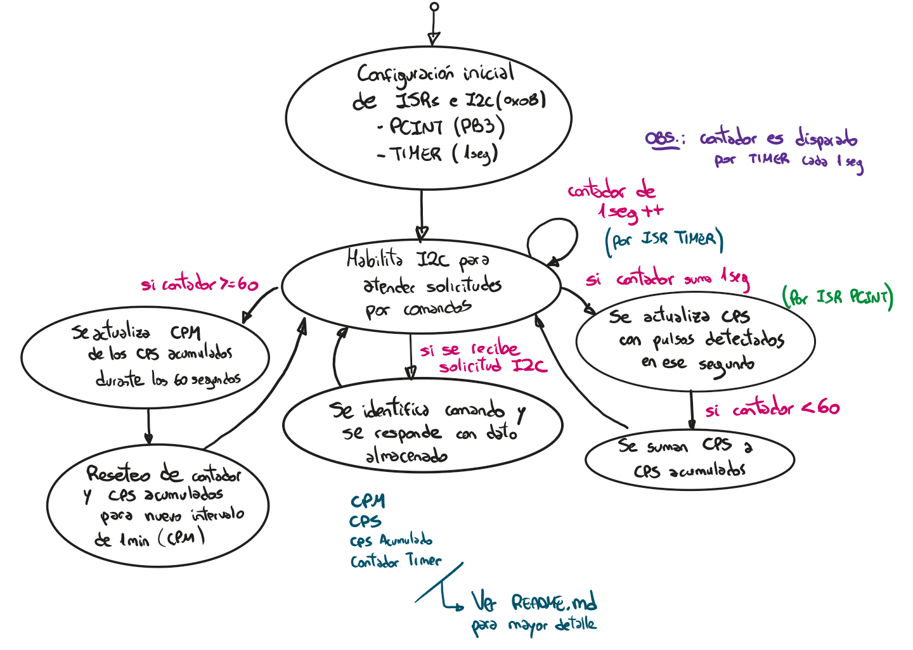
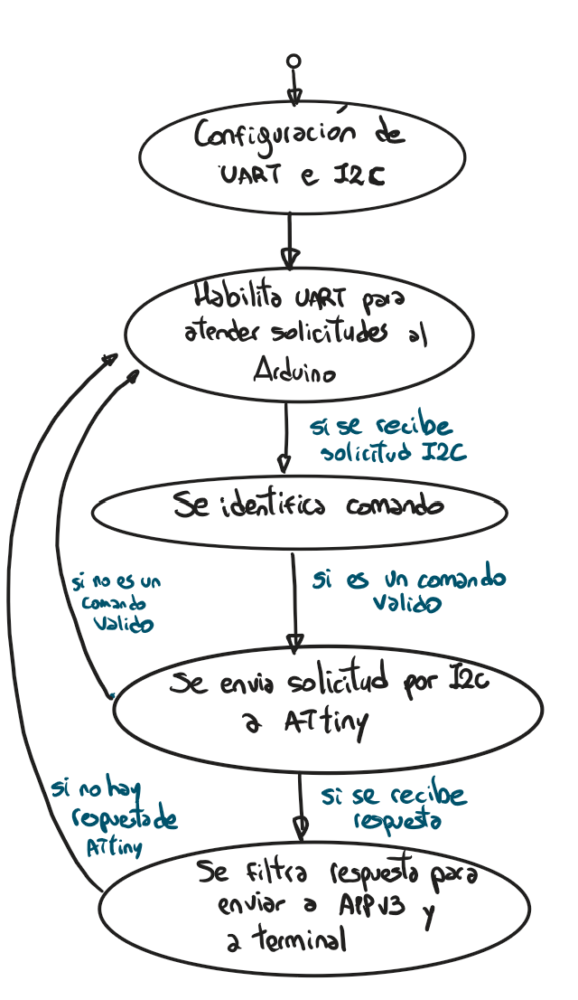

 

# PocketCube

Proyecto satelital desarrollado por el grupo de investigación **SyCE** (Simulación y Cálculo de Campos Electromagnéticos).

---

## 🎯 Objetivo

Este documento es una **guía básica de uso** de la aplicación PocketCube. Está pensada para personas **sin experiencia previa en programación o sistemas embebidos**.

La aplicación permite:

* Verificar en tiempo real el funcionamiento de un **ATtiny85**.
* Consultar mediciones de pulsos (CPS / CPM) provenientes del sensor **BG51**.
* Ejecutar ensayos automáticos y exportar los resultados.

Además, se describe:

* El funcionamiento interno del ATtiny.
* El uso de la librería **`Pocket.cpp`** para interactuar con el sistema.

---

## 🖥️ Aplicación


La aplicación cuenta con **dos modos de funcionamiento**:

* **Modo Manual**
* **Modo Ensayo (Automático)**

En ambos casos es **obligatorio seleccionar un puerto COM válido**.

> ⚠️ Si el puerto seleccionado no corresponde al Arduino, **no se recibirá ninguna respuesta**.

La comunicación se realiza mediante mensajes estructurados:

```text
Query   : [CMD_Arduino], [CMD]
Request : [ID_widget], [dato1] [dato2] [...]
```

---

### 📤 Identificadores de respuesta (ID_widget)

| ID_widget     | Descripción                                    |
| ------------- | ---------------------------------------------- |
| SEND_CPS_APP  | Actualiza tabla y gráfico de CPS               |
| SEND_CPM_APP  | Actualiza tabla y gráfico de CPM               |
| SEND_LINE_APP | Muestra respuesta directa en un campo de texto |

### 📡 Comandos hacia Arduino

| CMD_Arduino | Descripción                                      |
| ----------- | ------------------------------------------------ |
| CMD_I2C     | Indica al Arduino que envíe la solicitud por I2C |

---

## 🧭 Modo Manual

El **Modo Manual** se habilita automáticamente al iniciar la aplicación, siempre que exista al menos un puerto COM disponible.

Permite al usuario enviar **comandos individuales** presionando botones específicos.




### 📘 Comandos disponibles

| Botón      | Comando (CMD) | Qué devuelve el ATtiny                         | Formato de respuesta  |
| -----------| ------------- | ---------------------------------------------- | --------------------- |
| Último CPM | CPM           | Pulsos detectados en el último minuto completo | [ID], [CPM]           |
| CPS actual | CPS_NOW_ACCUM | Pulsos acumulados en el minuto actual          | [ID], [CPS_NOW_ACCUM] |
| TIME       | TIME          | Tiempo interno del ATtiny (segundos)           | [ID], [TIME]          |

Al presionar un botón, la respuesta del ATtiny se muestra directamente en la aplicación.



---

## ⏱️ Modo Ensayo (Automático)

En este modo, las consultas se realizan **de forma automática** durante un período definido.

1. Se configura la duración del ensayo en formato **HH:MM**.
2. Se presiona **Iniciar**.
3. La aplicación comienza a enviar consultas periódicas.



### 🔁 Frecuencia de consultas

| Comando (CMD) | Cada cuánto se envía | Qué devuelve                           | Formato de respuesta |
| ------------- | -------------------- | -------------------------------------- | -------------------- |
| CPS_TIME      | 1 segundo            | CPS del segundo actual + tiempo ATtiny | [ID], [CPS] [TIME]   |
| CPM_TIME      | 60 segundos          | CPM del último minuto + tiempo ATtiny  | [ID], [CPM] [TIME]   |

Durante el ensayo:

* Los datos se visualizan en tablas y gráficos.
* Se puede **finalizar manualmente** el ensayo.

Al finalizar, se habilita la **exportación a CSV** y nuevamente el **Modo manual**.



---

### 📁 Archivos CSV generados

Los archivos se guardan automáticamente en:

```text
Escritorio/LogBG5
```

Formato del nombre:

```text
{id}_{YYYY-MM-DD_HH-MM-SS}.csv
```

Ejemplo:

```text
CPS_2026-01-29_11-09-52.csv
CPM_2026-01-29_11-09-52.csv
```

> ℹ️ La carpeta se crea automáticamente si no existe.

>#### ⚠️ Aclaración importante  
>* Solo se guardan en el CSV los datos **visibles en la aplicación**.  
>* Si alguna respuesta demora más de 1 segundo, puede perderse debido a que la comunicación es **por streaming**.  
>* Para compensar esto, la tabla incluye la columna **"Seg."**, que indica el segundo real contado por el ATtiny.

---

## 🔌 Funcionamiento del ATtiny85

El ATtiny funciona de manera **totalmente independiente**:

* Al alimentarse, comienza a contar pulsos del sensor **BG51**.
* Almacena las mediciones internamente.
* Responde únicamente cuando recibe solicitudes por **I2C**.



### ⚙️ Parámetros clave

* **Dirección I2C:** `0x08`
* **Interrupción TIMER:** cada 1 segundo
* **Interrupción PCINT:** flanco ascendente en pin **PB3**

### ⏲️ Lógica del temporizador

| Segundo | Acción realizada             | CPS | CPM |
| ------- | ---------------------------- | --- | --- |
| 1       | Actualiza CPS                | 1   | 0   |
| 60      | Actualiza CPM y reinicia CPS | 0   | 1   |
| 120     | Actualiza CPM y reinicia CPS | 0   | 1   |

> El pin **PB3** detecta pulsos durante cada segundo, y el TIMER define cuándo actualizar las variables.

---

## 📦 Librería Pocket.cpp

Para simplificar la comunicación con el ATtiny se provee la librería **`Pocket.cpp`**.



### 🔧 Funciones principales

* `request(uint8_t cmd)`
* `requestFromAppUart(int* id, int* cmd)`

#### ¿Qué hace cada una?

* **requestFromAppUart(ID, CMD)**
  Filtra solicitudes provenientes de la aplicación / terminal y prepara el comando.

* **request(cmd)**
  Envía directamente un comando al ATtiny usando el formato:

```text
[CMD_Arduino], [CMD_ATtiny]
```

Ejemplo:

```text
[CMD_I2C], [CPS_NOW]  >> 1,2
```

---

### 📑 Comandos soportados

|CMD | Macro de CMD  | Uso                      | Query I2C | Ejemplo respuesta | Interpretación                   |
|--- | ------------- | ------------------------ | --------- | ----------------- | -------------------------------- |
|1   | CPM           | Último CPM               | 1,1       | 1,85              | 85 pulsos en el último minuto    |
|2   | CPS_NOW       | CPS actual               | 1,2       | 1,148             | 148 pulsos en el segundo actual  |
|3   | TIME          | Tiempo interno           | 1,3       | 1,27              | 27 segundos desde inicio         |
|4   | CPS_NOW_ACCUM | CPS acumulado del minuto | 1,4       | 1,258             | 258 pulsos acumulados            |
|5   | CPS_TIME      | CPS + tiempo             | 1,5       | 1,258 25          | 258 pulsos hasta el segundo 25   |
|6   | CPM_TIME      | CPM + tiempo             | 1,6       | 1,85 32           | 85 pulsos, segundo 32 del minuto |

---
